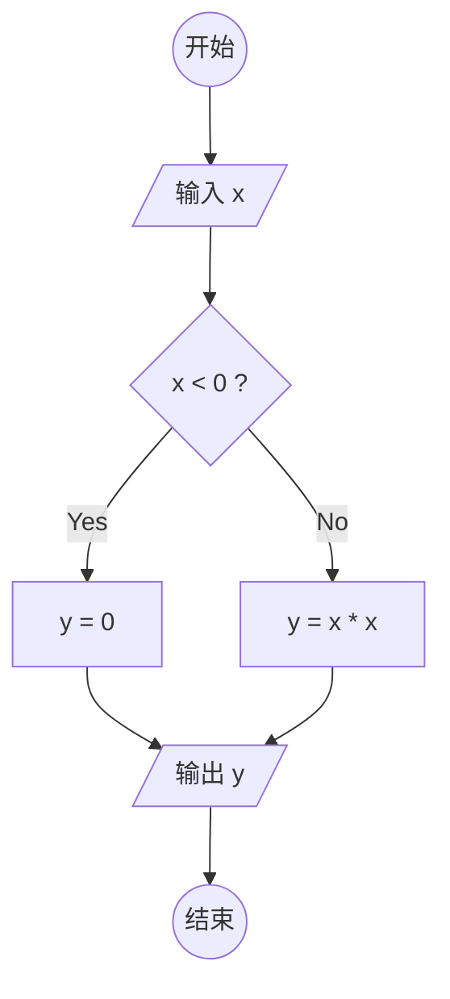
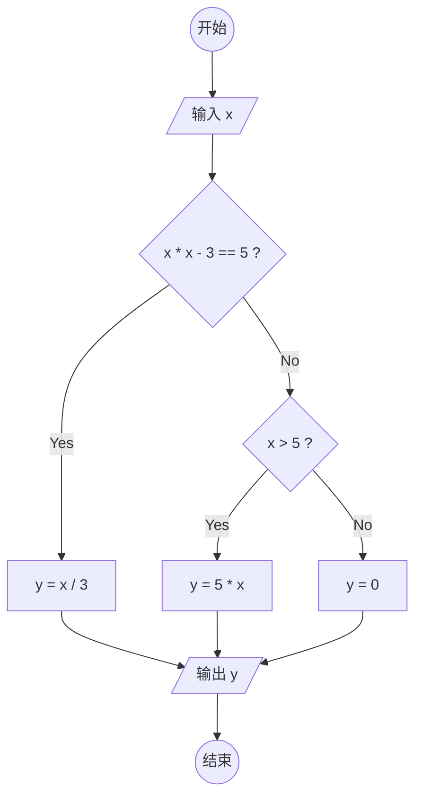

使用 GhatGPT 辅助绘图。

<!-- more -->

[[TOC]]

## 1. 生成 Mermaid 图形代码

```card
title: AI 提示
desc: 使用 Mermaid 语法绘制流程图，模仿下面的 Mermaid 代码风格。要求表示下面的 Python 代码，有开始和结束，正确表示输入输出。
link: https://chat.openai.com/
logo: /assets/chatgpt.svg
color: rgba(226, 212, 255, 0.2)
```

生成示范：

````markdown
使用 Mermaid 语法绘制流程图，模仿下面的 Mermaid 代码风格。
要求表示下面的 Python 代码，有开始和结束，正确表示输入输出。



```python
x = int(input())
if x * x - 3 == 5:
    y = x / 3
elif x > 5:
    y = 5 * x
else:
    y = 0
```
````

我们就得到了下面的代码：

```text
graph TD
    start(("开始")) --> input1[/"输入 x"/]
    input1 --> decision1{x * x - 3 == 5 ?}
    decision1 -- Yes --> y1[y = x / 3]
    decision1 -- No --> decision2{x > 5 ?}
    decision2 -- Yes --> y2[y = 5 * x]
    decision2 -- No --> y3[y = 0]
    y1 --> output1[/"输出 y"/]
    y2 --> output1
    y3 --> output1
    output1 --> End(("结束"))
```

效果如下：



同样适用于生成 E-R 图或者其他各种类型的图。

## 2. 配合 draw.io 使用

使用 ChatGPT 生成对应图形代码，然后插入到 draw.io 中，即可快速绘制我们需要的图形。

[draw.io](https://app.diagrams.net/) 是一个在线绘图工具，可以绘制各种图形，包括流程图、E-R 图、UML 图等等。

如果需要将 Mermaid 图形转换为 draw.io 图形，可以点击菜单栏的 **调整图形 (Arrange)** ->  **插入 (Insert)** -> **高级 (Advanced)** -> **Mermaid...**，然后将 Mermaid 图形代码粘贴到弹出的对话框中，点击 **插入 (Insert)** 即可。当然，[Mermaid 在线网站](https://mermaid.live/) 也可以完成这个功能，导出为 SVG 即可。

同样也可以生成 PlantUML 图等图标，也可以从 SVG、CSV 等代码中导入。
