各种激活函数合集。

<!-- more -->

<!-- 使用 SymPy + Matplotlib 绘制函数 -->

## 1. 简单激活函数

### 1.1 恒等函数

$$
f(x) = x
$$

$$
f'(x) = 1
$$

<!-- plot(x, xlabel='', ylabel='').save('x.svg') -->

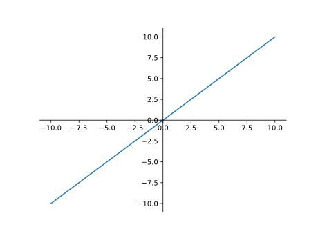

### 1.2 单位阶跃函数

$$
f(x) = \begin{cases}
    0, & x < 0 \\
    1, & x \geqslant 0
\end{cases}
$$

$$
f'(x) = \begin{cases}
    0, & x \neq 0
\end{cases}
$$

<!-- plot(Piecewise((0, x < 0), (1, True)), xlabel='', ylabel='').save('step.svg') -->

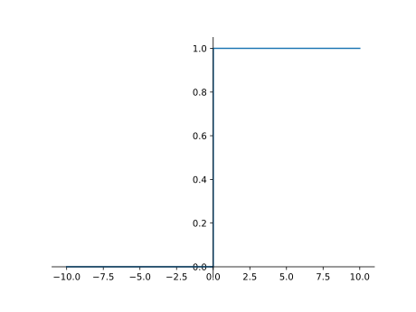

### 1.3 Sigmoid 函数

$$
f(x) = \frac{1}{1 + \mathrm{e}^{-x} }
$$

$$
\begin{aligned}
    f'(x)
    &= f(x)\left(1 - f(x)\right) \\
    &= \frac{ \mathrm{e}^{-x} }{ (1 + \mathrm{e}^{-x})^2 } \\
    &= \frac{1}{4\cosh^2\left(x / 2\right)}
\end{aligned}
$$

<!-- plot(1 / (1 + exp(-x)), xlabel='', ylabel='').save('sigmoid.svg') -->

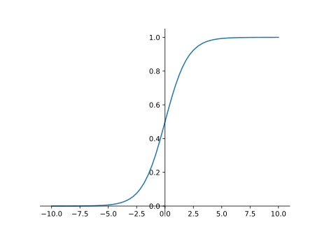

### 1.4 双曲正切（Tanh）

$$
\begin{aligned}
    f(x)
    &= \tanh(x) \\
    &= \frac{\sinh(x)}{\cosh(x)} \\
    &= \frac{\mathrm{e}^x - \mathrm{e}^{-x} }{\mathrm{e}^x + \mathrm{e}^{-x} }
\end{aligned}
$$

$$
\begin{aligned}
    f'(x)
    &= 1 - f^2(x) \\
    &= \frac{1}{\cosh^2(x)}
\end{aligned}
$$

<!-- plot(tanh(x), xlabel='', ylabel='').save('tanh.svg') -->

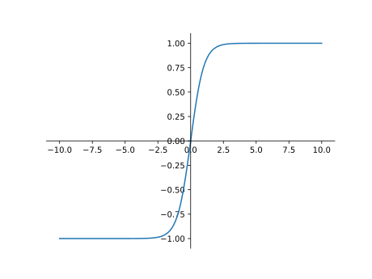

### 1.5 反正切（Arctan）

$$
f(x) = \arctan(x)
$$

$$
f'(x) = \frac{1}{x^2 + 1}
$$

<!-- plot(atan(x), xlabel='', ylabel='').save('arctan.h') -->

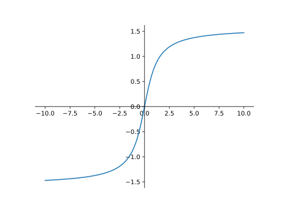

### 1.6 Softsign 函数

$$
f(x) = \frac{x}{1 + \left|x\right|}
$$

$$
f'(x) = \frac{1}{(1+|x|)^2}
$$

<!-- plot(x / (1 + Abs(x)), xlabel='', ylabel='').save('softsign.svg') -->

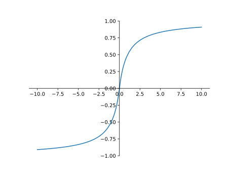

### 1.7 反平方根函数（ISRU）

$$
f(x) = \frac{x}{ \sqrt{1 + \alpha x^2} }
$$

$$
f'(x) = \left(\frac{1}{ \sqrt{1 + \alpha x^2} }\right)^3
$$

<!-- plot(x / sqrt(1 + 0.25 * x ** 2), xlabel='', ylabel='').save('ISRU.svg') -->

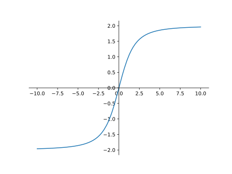

## 2. 线性激活单元

### 2.1 线性整流函数（ReLU）

$$
f(x) = \max(0,\, x)
$$

$$
f'(x) = \begin{cases}
    0, & x < 0 \\
    1, & x > 0
\end{cases}
$$

<!-- plot(Max(x, 0), xlabel='', ylabel='').save('ReLU.svg') -->

### 2.2 带泄露的线性整流函数（Leakly ReLU）

$$
f(x) = \max(\alpha x,\, x),\, \alpha \in (0,\, 1)
$$

$$
f'(x) = \begin{cases}
    \alpha, & x < 0 \\
    1, & x > 0
\end{cases}
$$

一般取 $\alpha = 0.01$。

<!-- plot(Max(x, 0.05 * x), xlabel='', ylabel='').save('LeaklyReLU.svg') -->

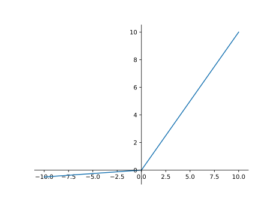

### 2.3 指数线性单元（ELU）

$$
f(x) = \begin{cases}
    \alpha(\mathrm{e}^x - 1), & x < 0 \\
    x, & x \geqslant 0
\end{cases}
$$

$$
f'(x) = \begin{cases}
    \alpha\mathrm{e}^{x}, & x < 0 \\
    1, & x > 0
\end{cases}
$$

<!-- plot(Piecewise((0.2 * (exp(x) - 1), x < 0), (x, True)), xlabel='', ylabel='').save('ELU.svg') -->

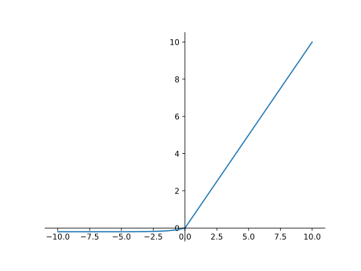

### 2.4 扩展型指数线性单元（SELU）

$$
f(x) = \lambda\begin{cases}
    \alpha(\mathrm{e}^x - 1), & x < 0 \\
    x, & x \geqslant 0
\end{cases}
$$

$$
f'(x) = \lambda\begin{cases}
    \alpha\mathrm{e}^{x}, & x < 0 \\
    1, & x > 0
\end{cases}
$$

其中

$$
\begin{aligned}
    a &\approx 1.6732632423543772848170429916717 \\
    \lambda &\approx 1.0507009873554804934193349852946
\end{aligned}
$$

<!-- plot(1.0507009873554804934193349852946 * Piecewise((1.6732632423543772848170429916717 * (exp(x) - 1), x < 0), (x, True)), xlabel='', ylabel='').save('SELU') -->

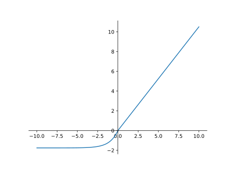

### 2.5 SiLU 函数（Swish 函数）

$$
\begin{aligned}
    f(x)
    &= x\sigma(x) \\
    &= \frac{x}{1 + \mathrm{e}^{-x} }
\end{aligned}
$$

$$
\begin{aligned}
    f'(x)
    &= f(x) + \sigma(x)\left(1 - f(x)\right) \\
    &= \frac{x + \mathrm{e}^x + 1}{4\cosh^2\left(x / 2\right)}
\end{aligned}
$$

<!-- plot(x / (1 + exp(-x)), xlabel='', ylabel='').save('SiLU.svg') -->

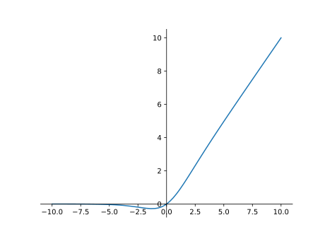

### 2.6 Softplus

$$
f(x) = \log(1 + \mathrm{e}^x)
$$

$$
f'(x) = \frac{\mathrm{e}^x}{1 + \mathrm{e}^x}
$$

<!-- plot(log(1 + exp(x)), xlabel='', ylabel='').save('softplus.svg') -->

### 2.6 Hard-Swish

<!-- *@TODO* -->

### 2.7 Mish

<!-- *@TODO* -->

### 2.8 GELU

<!-- *@TODO* -->

## 3. 多参数激活函数

### 3.1 Softmax 函数

$$
\mathrm{softmax}(z_i) = \frac{\mathrm{e}^{z_i}}{\sum_{k=1}^C \mathrm{e}^{z_k}}
$$

> 关于 Softmax 我们之后会进行讨论，*@TODO* 增加链接。

### 3.2 Maxout 函数

<!-- *@TODO* -->
