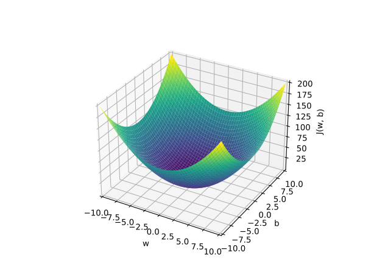
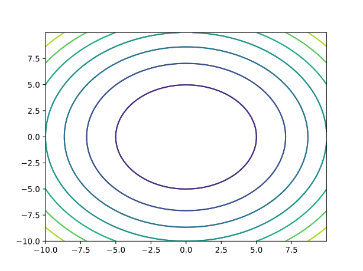

吴恩达机器学习课程，第二章。

<!-- more -->

[[TOC]]

<!-- 写作指南：echarts 生成函数图像 src/plot.js -->

## 2.1 示例

我们还是以房价问题为例。

::: echarts 波特兰的房子面积和价格散点图

```json
{
  "xAxis": {
    "type": "value",
    "name": "平方英尺",
    "splitLine": {
      "lineStyle": {
        "type": "dashed"
      }
    }
  },
  "yAxis": {
    "type": "value",
    "name": "1000 美元",
    "splitLine": {
      "lineStyle": {
        "type": "dashed"
      }
    }
  },
  "tooltip": {
    "trigger": "axis",
    "axisPointer": {
      "type": "cross"
    }
  },
  "series": [
    {
      "data": [
        [2104, 400],
        [1600, 330],
        [2400, 369],
        [1416, 232],
        [1985, 300],
        [1534, 315],
        [1427, 199],
        [1380, 212],
        [1494, 242],
        [1940, 240],
        [2000, 347],
        [1890, 330],
        [1268, 260],
        [2300, 450],
        [1320, 300],
        [1236, 200],
        [2609, 500],
        [1767, 253],
        [1888, 255],
        [1604, 243],
        [1962, 260],
        [1100, 250],
        [1458, 464],
        [2526, 469],
        [2200, 475],
        [2637, 300],
        [1839, 350],
        [1000, 170],
        [2040, 315],
        [1811, 286],
        [1437, 250],
        [1239, 230],
        [2132, 345],
        [2162, 287],
        [1664, 368],
        [2238, 330],
        [2567, 314],
        [1200, 299],
        [852, 180],
        [1852, 300],
        [1203, 240]
      ],
      "type": "scatter",
      "encode": { "tooltip": [0, 1] }
    }
  ]
}
```

:::

我们的目标是构建一个模型，当我获得一个面积的时候，我应该给这个房子的估价是多少？这是单变量回归问题，我们最容易想到的就是线性回归。

## 2.2 线性回归

线性回归是非常典型的监督学习，我们预先给出 “正确答案”，然后让模型预测 $x$ 对应的未知的 $y$。

| 面积（平方英尺） | 房价（1000\$） |
| ---------------- | -------------- |
| 2104             | 400            |
| 1600             | 330            |
| 2400             | 369            |
| 1416             | 232            |
| 1985             | 300            |
| 1534             | 315            |
| 1427             | 199            |
| 1380             | 212            |
| 1494             | 242            |
| ...              | ...            |

假设我们的数据有 $m$ 条，定义

$$
\left(x^{(i)},\, y^{(i)}\right)
$$

为第 $i$ 条数据。对于我们的数据集，其 $(x^{(1)},\,y^{(1)})$ 就对应 $(2104,\, 400)$。

当我们估计一个 $x$ 时，我们得到的值是 $y$ 的估计值，即 $\hat{y}$

$$
\hat{y} = f(x)
$$

我们需要的模型即为 $f$，那么我们应该如何确定我们的 $f$ 呢。我们这一节以线性模型为例，所以 $f$ 应该是一个一次函数，我们把参数 $w$ 和 $b$ 放在 $f$ 的下面来表示这是一个参数而非变量。$w,\,b$ 也被称为系数或权重。

$$
f_{w,\,b}(x) = wx + b
$$

*@def* 像上面这样，数据使用线性预测函数来建模被称为 **线性回归**，当数据 $x$ 如上所示维度为一时，线性回归也可以称为 **单变量线性回归**。

### 2.3 损失函数

我们在预测时，我们需要知道预测值和目标值误差有多大，我们可以简单地衡量出来

$$
\hat{y} - y
$$

当我们需要知道这个模型效果的好坏时，我们往往要计算平方误差

$$
\frac{1}{m}\sum_{i=1}^m \left(\hat{y}^{(i)} - y^{(i)}\right)^2
$$

我们除以 $m$ 的原因是希望误差不会随着数据量额增大而持续变大，而上面的式子能够很好地衡量出这个直线对数据的拟合误差。

我们在机器学习中通常会将其除以 $2$，这只是为了让计算整洁，对结果没有任何影响。我们一般将误差函数记作 $J(w,\,b)$，将 $\hat{y}^{(i)}$ 带入上式

$$
J(w,\,b) = \frac{1}{2m}\sum_{i=1}^m \left(f_{w,\,b}(x^{i}) - y^{(i)}\right)^2
$$

### 2.4 损失函数的直观理解

回顾我们的工作：

| 项目     | 值                         |
| -------- | -------------------------- |
| 模型     | $f_{w,\,b}(x) = wx + b$    |
| 参数     | $w,\,b$                    |
| 损失函数 | $J(w,\,b)$                 |
| 目标     | $\argmin_{w,\,b} J(w,\,b)$ |

我们进行一些化简：如果我们直接取 $b = 0$，即让直线经过原点，这个问题就变得简单一些。

$$
f_w(x) = wx
$$

我们只需要得到

$$
\argmin_{w} J(w) = \frac{1}{2m} \sum_{i=1}^m \left(f_{w}(x^{i}) - y^{(i)}\right)^2
$$

设我们有三个点 $(1,\, 1)$、$(2,\, 2)$ 和 $(3,\, 3)$，我们尝试拟合这三个点，我们不断尝试 $w$ 的值，然后计算损失值并由此绘制函数图像。

::: echarts 损失函数图像

```json
{"xAxis":{"name":"w","minorTick":{"show":true},"minorSplitLine":{"show":true}},"yAxis":{"name":"J(w)","min":-1,"max":20,"minorTick":{"show":true},"minorSplitLine":{"show":true}},"tooltip":{"trigger":"axis","axisPointer":{"type":"cross"}},"series":[{"type":"line","showSymbol":false,"clip":true,"data":[[-4,25],[-3.95,24.5025],[-3.9,24.01],[-3.85,23.5225],[-3.8,23.04],[-3.75,22.5625],[-3.7,22.09],[-3.65,21.6225],[-3.6,21.16],[-3.55,20.7025],[-3.5,20.25],[-3.45,19.8025],[-3.4,19.36],[-3.35,18.9225],[-3.3,18.49],[-3.25,18.0625],[-3.2,17.64],[-3.15,17.2225],[-3.1,16.81],[-3.05,16.4025],[-3,16],[-2.95,15.6025],[-2.9,15.21],[-2.85,14.8225],[-2.8,14.44],[-2.75,14.0625],[-2.7,13.69],[-2.65,13.3225],[-2.6,12.96],[-2.55,12.6025],[-2.5,12.25],[-2.45,11.9025],[-2.4,11.56],[-2.35,11.2225],[-2.3,10.89],[-2.25,10.5625],[-2.2,10.24],[-2.15,9.9225],[-2.1,9.61],[-2.05,9.3025],[-2,9],[-1.95,8.7025],[-1.9,8.41],[-1.85,8.1225],[-1.8,7.84],[-1.75,7.5625],[-1.7,7.29],[-1.65,7.0225],[-1.6,6.76],[-1.55,6.5025],[-1.5,6.25],[-1.45,6.0025],[-1.4,5.76],[-1.35,5.5225],[-1.3,5.29],[-1.25,5.0625],[-1.2,4.84],[-1.15,4.6225],[-1.1,4.41],[-1.05,4.2025],[-1,4],[-0.95,3.8025],[-0.9,3.61],[-0.85,3.4225],[-0.8,3.24],[-0.75,3.0625],[-0.7,2.89],[-0.65,2.7225],[-0.6,2.56],[-0.55,2.4025],[-0.5,2.25],[-0.45,2.1025],[-0.4,1.96],[-0.35,1.8225],[-0.3,1.69],[-0.25,1.5625],[-0.2,1.44],[-0.15,1.3225],[-0.1,1.21],[-0.05,1.1025],[0,1],[0.05,0.9025],[0.1,0.81],[0.15,0.7225],[0.2,0.64],[0.25,0.5625],[0.3,0.49],[0.35,0.4225],[0.4,0.36],[0.45,0.3025],[0.5,0.25],[0.55,0.2025],[0.6,0.16],[0.65,0.1225],[0.7,0.09],[0.75,0.0625],[0.8,0.04],[0.85,0.0225],[0.9,0.01],[0.95,0.0025],[1,0],[1.05,0.0025],[1.1,0.01],[1.15,0.0225],[1.2,0.04],[1.25,0.0625],[1.3,0.09],[1.35,0.1225],[1.4,0.16],[1.45,0.2025],[1.5,0.25],[1.55,0.3025],[1.6,0.36],[1.65,0.4225],[1.7,0.49],[1.75,0.5625],[1.8,0.64],[1.85,0.7225],[1.9,0.81],[1.95,0.9025],[2,1],[2.05,1.1025],[2.1,1.21],[2.15,1.3225],[2.2,1.44],[2.25,1.5625],[2.3,1.69],[2.35,1.8225],[2.4,1.96],[2.45,2.1025],[2.5,2.25],[2.55,2.4025],[2.6,2.56],[2.65,2.7225],[2.7,2.89],[2.75,3.0625],[2.8,3.24],[2.85,3.4225],[2.9,3.61],[2.95,3.8025],[3,4],[3.05,4.2025],[3.1,4.41],[3.15,4.6225],[3.2,4.84],[3.25,5.0625],[3.3,5.29],[3.35,5.5225],[3.4,5.76],[3.45,6.0025],[3.5,6.25],[3.55,6.5025],[3.6,6.76],[3.65,7.0225],[3.7,7.29],[3.75,7.5625],[3.8,7.84],[3.85,8.1225],[3.9,8.41],[3.95,8.7025],[4,9],[4.05,9.3025],[4.1,9.61],[4.15,9.9225],[4.2,10.24],[4.25,10.5625],[4.3,10.89],[4.35,11.2225],[4.4,11.56],[4.45,11.9025],[4.5,12.25],[4.55,12.6025],[4.6,12.96],[4.65,13.3225],[4.7,13.69],[4.75,14.0625],[4.8,14.44],[4.85,14.8225],[4.9,15.21],[4.95,15.6025],[5,16],[5.05,16.4025],[5.1,16.81],[5.15,17.2225],[5.2,17.64],[5.25,18.0625],[5.3,18.49],[5.35,18.9225],[5.4,19.36],[5.45,19.8025],[5.5,20.25],[5.55,20.7025],[5.6,21.16],[5.65,21.6225],[5.7,22.09],[5.75,22.5625],[5.8,23.04],[5.85,23.5225],[5.9,24.01],[5.95,24.5025],[6,25]]}]}
```

:::

我们的目标是通过寻找 $w$ 的值，使其最小。通过图像，我们发现我们的示例最小值在 $w = 1$ 处（如上图）。

### 2.5 可视化损失函数

让我们回到最初的优化目标

$$
\argmin_{w,\,b} J(w,\,b)
$$

事实上，如果我们想可视化 $J(w,\,b)$，这将会是一个三维的函数（表现为曲面），



我们可以通过它来绘制等高图，等高线上的每一个点的损失值都相同。



在本节的 Jupyter Notebook 你可以看到交互式的演示。

现在让我们回到主题，什么是机器学习？就是让机器自动地寻找解决问题的最优方法，我们应该提供一个有效算法，让我们不用手动计算每一处的损失值，让机器能够自动地去发现最小的损失值。

下面我们将介绍梯度下降，这不仅仅能解决单变量线性回归问题，也能够解决人工智能中最大最复杂的模型优化问题。
