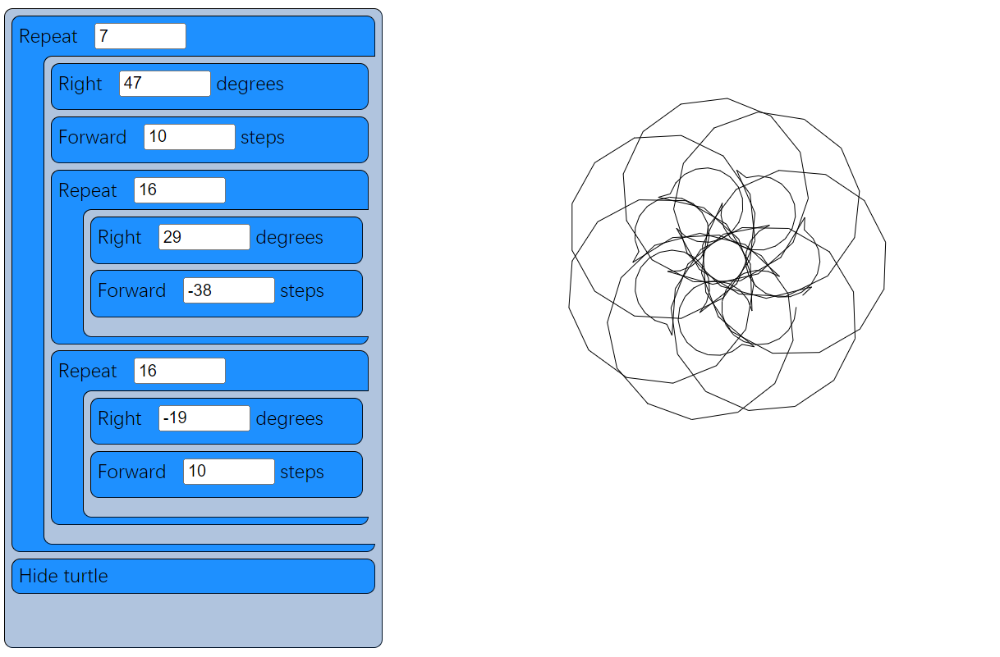

第二章：Blockcode：一个可视化编程工具。

<!-- more -->

[[TOC]]

::: info 原文信息

本文的翻译部分参考了 [此篇博客](https://blog.csdn.net/code_for_fun/article/details/51898028) 的内容。

本文的原文可访问 [aosabook.org](http://aosabook.org/en/500L/blockcode-a-visual-programming-toolkit.html) 阅读。

:::

[Dethe](https://twitter.com/dethe) 是一个极客老爸，具有审美趣味的程序员，导师，以及可视化编程工具 [Waterbear](http://waterbearlang.com/) 的作者。他联合创办了温哥华手工制作教育沙龙并且满心希望机器纸折兔能火遍全球。

在基于块的编程语言中，你通过拖动和连接代表程序不同部分的块来进行编程。而在一般的编程语言中，你是通过键入字符来编程的。

学习编程可能很困难，因为一般编程语言对于拼写错误是零容忍的。大部分的编程语言都是大小写敏感的，并且语法比较晦涩，哪怕是少写一个分号都会拒绝运行程序。更有甚者，大部分的编程语言是基于英语的并且语法不能本地化。

相反，基于块的语言可以完全消除语法错误，你的程序仅仅可能发生逻辑错误。块语言也更加直观，你可以在块列表中看到所有的程序构件和语言库。更有甚者，块可以被本地化任意的人类语言而不用改变编程语言的含义。


基于块的语言历史悠久，比较著名的有 [Lego Mindstorms](http://www.lego.com/en-us/mindstorms/)，[Alice3D](http://www.alice.org/index.php)，[StarLogo](http://education.mit.edu/projects/starlogo-tng)，还有 [Scratch](http://scratch.mit.edu/) 。还有一些在 Web 上可以访问的：[Blockly](https://developers.google.com/blockly/)，[AppInventor](http://appinventor.mit.edu/explore/)，[Tynker](http://www.tynker.com/) 以及更多。

本章的代码基于开源项目 [Waterbear](http://waterbearlang.com/)，这不是一个语言，而是将其他现存语言包装成块语法的工具。该包装器的作用包括以上提到的几点：消除语法错误，方便本地化。除此之外，可视化的代码有时更加容易阅读和调试，还不会打字的儿童也能使用块。（可以更进一步地在块上放置图标，也可以加上文字，提供给学前儿童使用，然而这个功能我们先不考虑）。

该语言选择使用的龟图（turtle graphics）可以追溯到 Logo 语言，这是一个特地教导儿童编程的语言。许多基于块的语言都包括了龟图，该主题很适合用于一个类似被严格限制的项目。

如果想事先体验一下基于块的语言是怎么样的，可以到 [作者的 Github](https://dethe.github.io/500lines/blockcode/) 进行实验。

## 目标和结构

通过本章的代码我希望能实现几点。首先，我要为龟图（turtle graphics）实现一个块语言，通过简单的拖放块，你可以编写程序创建图案，我想通过简单的 HTML，CSS 和 JavaScript 来实现。其次，我要展示如何将块构想成为一个框架，服务于其他语言而不仅仅是简单的 **海龟语言**（turtle language）。

为了做到这点，我将海龟语言相关部分全部封装到了一个文件（`turtle.js`），这样我就可以轻易替换成其他文件。除此之外的任何代码都不是特定于海龟语言；其他的代码全部用来处理块（`blocks.js` 和 `menu.js`）或者是通用的 Web 工具（`util.js`，`drag.js`，`file.js`）。这是目标，然后为了使得工程尽量小型化，一些工具不是足够通用而与块相关。

在编写一个块语言时，让我惊奇的是，语言就是它自己的 IDE。你不能使用自己喜欢的编辑器；IDE 的设计要和块语言同步进行。这样有利有弊。好处是所有人都使用一致的环境从而避免的关于编辑器优劣的争论。坏处是会影响构建语言。

### 脚本的本质

和任何其他语言的脚本一样，一个 Blockcode 脚本就是一系列的操作。对于 Blockcode 脚本来说，其中包含了一些 HTML 元素，脚本迭代执行每个 HTML 元素对应的 JavaScript 函数。一些块包含（负责执行）其他的块，还有一些块包含一些传递给函数的数值。

在大部分（基于文本）的语言中，一个脚本的执行会经历多个阶段：一个词法分析器将文本解析为 tokens，语法分析器将 tokens 组织成抽象语法树，然后根据语言的不同，可能会编译为机器码或者输入到解析器中。这是一个简化的描述；事实上可能会有更多步骤。对于 Blockcode，块的布局本身就代表了抽象语法树，因为我们可以免去词法分析和语法分析阶段。我们使用 **访问者模式**（Visitor Pattern）来迭代每个块并执行每个块预定义的函数来运行整个程序。

我们完全可以添加额外的步骤来将 Blockcode 变得更像一般的语音。除了简单的调用 JavaScript 函数外，我们还可以将 `turtle.js` 替换为一个能产生字节码的块语言，运行于其他的虚拟机。或者产生 C++ 代码用以编译运行。存在能够生成 Java 字节码的块语言（作为 Waterbear 项目的一部分），用于 Arduino 编程和为 Raspberry Pi 上运行的 Minecraft 编写脚本。

### Web 应用

为了让更多的人使用该工具，我们使用了 Web。该工具使用 HTML，CSS 和 JavaScript 编写，因为可以运行在大部分的浏览器和平台。

现代 Web 浏览器是一个强大的平台，提供了构建伟大软件的丰富工具。如果一些实现变得太过复杂，这就释放了一种信号，那就是我没有按照 Web 的方式来做，如果可能我就会试着使用浏览器工具来做得更好。

Web 应用和传统桌面应用或者服务器应用的一个重大的区别就是它没有 `main` 函数或者其他的入口。也没有显式地循环，因为这些已经被浏览器内置了。我们所有的代码都在加载的时候被分析和执行，在这个过程中我们可以对感兴趣的事件注册监听器用来和用户互动。在初次执行后，所有后续的互动都在相应事件中注册的回调中进行，要么是类似鼠标移动的事件，或者是设置的定时器。浏览器并没有暴露主要的线程（仅仅是共享的工作线程）。

## 代码分析

贯穿本项目始终，我都试着使用了最佳实践。每个 JavaScript 文件都被包含在一个函数中，从而避免变量泄露到全局环境中。如果需要暴露变量给其他文件，那么每个文件中根据文件名只定义单个 `global`，所有需要暴露的函数都在其中。这些都在接近文件尾部进行放置，接着就是该文件定义的各种事件处理器，因而只需要看一眼文件的末尾就能知道该文件定义的事件处理器和导出的函数。

代码是过程式的，没有采用面向对象或者函数式。我们可以使用任意一种范式来做同一件事，然而那些需要一更多的设置代码和包装代码来进行本已存在于DOM的东西。最近有个项目 [Custom Elements](http://webcomponents.org/) 使得你可以面向对象的方式操作 DOM，还有很多关于 [Functional JavaScript](https://leanpub.com/javascript-allonge/read) 的文章，然而这些都需要额外的工作，因此保持过程式使得问题更简单。

项目中有八个源文件，`index.html` 和 `blocks.css` 是应用的基本结构和样式因而不加讨论。还有两个 JavaScript 文件也不过多讨论：`util.js` 包含了一些工具函数，`file.js` 用于加载和保存文件并且序列化脚本。

剩下这些文件：

- `blocks.js` 是块语言的抽象表示
- `drag.js` 实现了语言的关键交互：允许用户从可选块（菜单）中拖拽块并组装成程序（脚本）
- `menu.js` 包含了一些工具代码并且负责实际地执行用户程序
- `turtle.js` 定义了块语言的特定细节（turtle graphics）并且初始化特定的块。如果需要定义不同的块语言，那么就替换该文件

### blocks.js

每一个块由一些 HTML 元素组成，由 CSS 设置样式，由一些 JavaScript 时间处理器处理拖拽并且修改输入参数。`blocks.js` 文件用于创建并管理这些元素，并且将它们组成单一的对象。当块被加入到菜单中时，绑定了一个 JavaScript 函数用来实现语言，因而脚本中的每个块在脚本执行的时候都要能找到其对应的函数并调用。


块有两种结构。一种拥有一个数值参数（具有默认值），还有一种作为其他块的容器。这些貌似很有限制，然而在一个大的系统中可以改进。在 Waterbear 中还有表达式块，可以作为参数进行传递；可以支持多个不同类型的值。在当前的状况下，我们试试只有一种类型的参数能干些什么。

```html
<!-- The HTML structure of a block -->
<div class="block" draggable="true" data-name="Right">
    Right
    <input type="number" value="5">
    degrees
</div>
```

需要注意的是，脚本中的块和菜单中的块没有区别。只有拖拽时会判断块是从哪儿拖出来的，脚本只会运行脚本区的块，然而它们本质上是一样的结构，这就意味着从菜单中向脚本区拖动块的时候可以进行克隆。

`createBlock(name, value, contents)` 函数返回一个代表块的 DOM 元素，并且在 DOM 中填充了各种内部元素，可以直接插入到 `document` 中。这可以用于向菜单区添加块，也可以用于从文件或 `localStorage` 中恢复块到脚本区。这个函数是专为 Blockcode 语言编写的，如果传入的 `value` 参数有值，那么就假定这是一个数值，并且创建一个 `number` 类型的 `input` 元素。该函数被限制用于 Blockcode，如果要扩展块以支持其他类型的参数，则需要更改代码。

```js
function createBlock(name, value, contents) {
    var item = elem('div',
        { 'class': 'block', draggable: true, 'data-name': name },
        [name]
    );
    if (value !== undefined && value !== null) {
        item.appendChild(elem('input', { type: 'number', value: value }));
    }
    if (Array.isArray(contents)) {
        item.appendChild(
            elem('div', { 'class': 'container' }, contents.map(function (block) {
                return createBlock.apply(null, block);
            })));
    } else if (typeof contents === 'string') {
        // Add units (degrees, etc.) specifier
        item.appendChild(document.createTextNode(' ' + contents));
    }
    return item;
}
```

我们有一些将块作为 DOM 处理的工具函数：

- `blockContents(block)` 返回容器块的子块。如果参数是容器块则以列表的形式返回子块，否则返回 `null`
- `blockValue(block)` 如果块中包含一个 `number` 类型的 `<input>` 则返回 `<input>` 的值，否则返回 `null`
- `blockScript(block)` 返回块的 JSON 形式，便于序列化。其后方便恢复
- `runBlocks(blocks)` 执行块数组中的所有块

```js
function blockContents(block) {
    var container = block.querySelector('.container');
    return container ? [].slice.call(container.children) : null;
}

function blockValue(block) {
    var input = block.querySelector('input');
    return input ? Number(input.value) : null;
}

function blockUnits(block) {
    if (block.children.length > 1 &&
        block.lastChild.nodeType === Node.TEXT_NODE &&
        block.lastChild.textContent) {
        return block.lastChild.textContent.slice(1);
    }
}

function blockScript(block) {
    var script = [block.dataset.name];
    var value = blockValue(block);
    if (value !== null) {
        script.push(blockValue(block));
    }
    var contents = blockContents(block);
    var units = blockUnits(block);
    if (contents) { script.push(contents.map(blockScript)); }
    if (units) { script.push(units); }
    return script.filter(function (notNull) { return notNull !== null; });
}

function runBlocks(blocks) {
    blocks.forEach(function (block) { trigger('run', block); });
}
```

### drag.js

`drag.js` 实现了菜单区和脚本区的交互，用于将静态的 HTML 块转变为动态的编程语言。用户从菜单区拖动块到脚本区来建构程序，系统执行脚本区的块。

我们使用 HTML5 的拖拽功能；需要的 JavaScript 事件处理器在这儿定义。（关于 HTML5 的拖拽，详情参考 [Eric Bidleman](http://www.html5rocks.com/en/tutorials/dnd/basics/) 的文章）内建支持拖拽固然很棒，然而也有一些限制，例如移动端浏览器上基本不支持。

文件开头定义了一些变量。当我们拖动时，需要在拖动的不同阶段的回调中引用它们。

```js
var dragTarget = null; // 正在拖动的块
var dragType = null; // 从菜单中还是脚本中拖动？
var scriptBlocks = []; // 脚本区中的块
```

根据拖动的起始点和结束位置，拖放会有不同的效果：

- 从脚本区拖放到菜单区则删除 `dragTarget`（从脚本区中删除块）
- 从脚本区拖放到脚本区则移动 `dragTarget`（在脚本区中移动现有块）
- 从菜单区拖放到脚本区则复制 `dragTarget`（向脚本区中插入新块）
- 从菜单拖放到菜单，不做任何事

在 `dragStart(evt)` 处理函数中我们开始跟踪块是从菜单拖放到脚本区还是相反，或者在脚本区内移动。我们还记录下了脚本区中所有没有被拖动的块，以便后来使用。`evt.dataTransfer.setData` 是用来处理浏览器和其他应用程序之间的拖放，这儿没有用上，仅仅是为了绕开一个 bug 才使用的。

```js
function dragStart(evt) {
    if (!matches(evt.target, '.block')) return;
    if (matches(evt.target, '.menu .block')) {
        dragType = 'menu';
    } else {
        dragType = 'script';
    }
    evt.target.classList.add('dragging');
    dragTarget = evt.target;
    scriptBlocks = [].slice.call(
        document.querySelectorAll('.script .block:not(.dragging)'));
    // For dragging to take place in Firefox, we have to set this, even if
    // we don't use it
    evt.dataTransfer.setData('text/html', evt.target.outerHTML);
    if (matches(evt.target, '.menu .block')) {
        evt.dataTransfer.effectAllowed = 'copy';
    } else {
        evt.dataTransfer.effectAllowed = 'move';
    }
}
```

当我们正在拖动时， 可以在 `dragenter`、`dragover` 和 `dragout` 事件中添加一些视觉线索，例如高亮放置区等等。其中我们只使用了 `dragover`。

```js
function dragOver(evt) {
    if (!matches(evt.target, '.menu, .menu *, .script, .script *, .content')) {
        return;
    }
    // Necessary. Allows us to drop.
    if (evt.preventDefault) { evt.preventDefault(); }
    if (dragType === 'menu') {
        // See the section on the DataTransfer object.
        evt.dataTransfer.dropEffect = 'copy';
    } else {
        evt.dataTransfer.dropEffect = 'move';
    }
    return false;
}
```

当我们松开鼠标时会有一个 `drop` 事件，这就是见证奇迹的时刻。我们需要检查拖放的起始点，然后要么复制块，要么移动块，或者删除块。我们使用 `trigger()`（定义在 `util.js` 中）启动了一些自定义事件用来刷新脚本区。

```js
function drop(evt) {
    if (!matches(evt.target, '.menu, .menu *, .script, .script *')) return;
    var dropTarget = closest(
        evt.target, '.script .container, .script .block, .menu, .script');
    var dropType = 'script';
    if (matches(dropTarget, '.menu')) { dropType = 'menu'; }
    // stops the browser from redirecting.
    if (evt.stopPropagation) { evt.stopPropagation(); }
    if (dragType === 'script' && dropType === 'menu') {
        trigger('blockRemoved', dragTarget.parentElement, dragTarget);
        dragTarget.parentElement.removeChild(dragTarget);
    } else if (dragType === 'script' && dropType === 'script') {
        if (matches(dropTarget, '.block')) {
            dropTarget.parentElement.insertBefore(
                dragTarget, dropTarget.nextSibling);
        } else {
            dropTarget.insertBefore(dragTarget, dropTarget.firstChildElement);
        }
        trigger('blockMoved', dropTarget, dragTarget);
    } else if (dragType === 'menu' && dropType === 'script') {
        var newNode = dragTarget.cloneNode(true);
        newNode.classList.remove('dragging');
        if (matches(dropTarget, '.block')) {
            dropTarget.parentElement.insertBefore(
                newNode, dropTarget.nextSibling);
        } else {
            dropTarget.insertBefore(newNode, dropTarget.firstChildElement);
        }
        trigger('blockAdded', dropTarget, newNode);
    }
}
```

`dragEnd(evt)` 在鼠标松开时被调用，然而是在我们处理了 `drop` 事件之后。这儿我们可以进行一些清理，删除元素中的 `class`，重置以便下次拖放。

```js
function _findAndRemoveClass(klass) {
    var elem = document.querySelector('.' + klass);
    if (elem) { elem.classList.remove(klass); }
}

function dragEnd(evt) {
    _findAndRemoveClass('dragging');
    _findAndRemoveClass('over');
    _findAndRemoveClass('next');
}
```

### menu.js

在文件 `menu.js` 中，块被绑定了执行时需要调用的函数，也包含了实际运行脚本区块的代码。每次脚本被修改后，会自动重新运行。

这里的菜单不是下拉式或者弹出式的，而是一个块的列表，从中你可以选择块，然后拖到脚本区。该文件就负责对菜单区进行设置，菜单区以一个提供循环功能的块（这不是海龟的一部分）开始。

使用一个文件收集分散的函数很有用，特别是项目还在开发的时候。保持房屋整洁的秘诀就是给杂乱的东西指定特定的地方存放，构建程序也是如此。对于归属不明确的部分，应该使用一个文件或者模块收集。当这个文件变得越来越大的时候，你就要注意了，应当将相关的函数抽取出来归并到一个单独的模块中（或者整合成一个更加通用的函数）。你不应该任由这个杂货区文件变得庞大，而仅仅将它作为一个临时放置区，直到你给其中的代码找到合理的归置之所。

我们会较多的使用 `menu` 和 `script`，因而保留它们的引用；没有必要每次都查找它们的 DOM。我们也会用到 `scriptRegistry`，它保存了菜单中块的脚本。我们简单的给菜单区中的块进行了命名，并进行了映射，不支持一个名字对应多个块也不支持重命名块。这种策略如果用在复杂的脚本环境中可能不够健壮。

我们使用 `scriptDirty` 来标识脚本区是否已被修改过了，因而可以避免反复执行脚本区。

```js
var menu = document.querySelector('.menu');
var script = document.querySelector('.script');
var scriptRegistry = {};
var scriptDirty = false;
```

当我们想通知系统在下一个 `frame` 处理器中运行脚本，调用 `runSoon()` 将 `scriptDirty` 设置为 `true`。系统在每一个 `frame` 中调用 `run()`，除非 `scriptDirty` 被设置，否则立即返回。当 `scriptDirty` 被设置为 `true` 时，运行脚本区中所有的块，并且触发事件使得特定的语言处理相关任务。这样做将块和海龟语言进行了解耦，使得块可以被重用（或者也可以说语言可插拔）。

在执行脚本的时候，我们遍历每个块，调用它的 `runEach(evt)`，该方法会在块上添加一个 `class`（用于 CSS），然后找到并调用与块绑定的函数。如果我们减慢执行速度，你将看到每个块在执行时会被高亮。

下面的 `requestAnimationFrame` 是浏览器提供的用作动画的函数。它接受一个函数作为参数，然后在渲染下一帧（每秒 60 帧）的时候使用。具体得到多少帧取决于我们能多块的处理任务。

```js
function runSoon() { scriptDirty = true; }

function run() {
    if (scriptDirty) {
        scriptDirty = false;
        Block.trigger('beforeRun', script);
        var blocks = [].slice.call(
            document.querySelectorAll('.script > .block'));
        Block.run(blocks);
        Block.trigger('afterRun', script);
    } else {
        Block.trigger('everyFrame', script);
    }
    requestAnimationFrame(run);
}
requestAnimationFrame(run);

function runEach(evt) {
    var elem = evt.target;
    if (!matches(elem, '.script .block')) return;
    if (elem.dataset.name === 'Define block') return;
    elem.classList.add('running');
    scriptRegistry[elem.dataset.name](elem);
    elem.classList.remove('running');
}
```

我们使用 `menuItem(name, fn, value, contents)` 向菜单中添加块，该函数接受一个普通块，然后给它绑定一个函数，并加入到菜单栏。

```js
function menuItem(name, fn, value, units) {
    var item = Block.create(name, value, units);
    scriptRegistry[name] = fn;
    menu.appendChild(item);
    return item;
}
```

我们在此处定义 `repeat(block)`，而不是在海龟语言中，因为我们希望这个函数可以在不同的语言中通用。如果我们有了 `if` 块和读写变量，这些也应该放到这里，或者是一个单独的 **语言转换**（trans-language）模块，然而此时我们只有这一个通用的块。

```js
function repeat(block) {
    var count = Block.value(block);
    var children = Block.contents(block);
    for (var i = 0; i < count; i++) {
        Block.run(children);
    }
}
menuItem('Repeat', repeat, 10, []);
```

### turtle.js

`turtle.js` 是 turtle 块语言的实现部分。它不被其他任何代码依赖。因而这一部分可以很轻易的替换。



海龟编程是图形编程的一种，由于 Logo 语言被大众所熟悉，简单的说就是一个携带着一只笔的龟头在屏幕上移动。你可以命令海龟头收起笔（不再画线，继续移动），放下笔（移动到哪儿，笔画到哪儿），移动指定数量步，或者转向多少度。仅仅依靠这些命令和循环，就可以画出静态图案。

在这个图形化版本中，我们有一些额外的块。技术上讲，我们并不需要 `turn right` 和 `turn left` 同时存在，因为拥有其中一个，那么另外一个可以使用负数完成。类似的 `move back` 也可以使用 `move forward` 加上负数解决。

上面的图案脚本，将两个循环放入另一个循环之中，然后给每个循环添加一个 `move forward` 和 `turn right`，然后调整参数，直到得到满意的图案。

```js
var PIXEL_RATIO = window.devicePixelRatio || 1;
var canvasPlaceholder = document.querySelector('.canvas-placeholder');
var canvas = document.querySelector('.canvas');
var script = document.querySelector('.script');
var ctx = canvas.getContext('2d');
var cos = Math.cos, sin = Math.sin, sqrt = Math.sqrt, PI = Math.PI;
var DEGREE = PI / 180;
var WIDTH, HEIGHT, position, direction, visible, pen, color;
```

`reset()` 函数将所有的状态变量恢复到默认状态。如果我们需要支持多个海龟头，可以将这些变量封装到一个对象中。`deg2rad(deg)` 函数用于将度转化为弧度，因为作图使用的是弧度。`drawTurtle()` 用于画海龟头自身，默认是一个简单的三角形。当然你可以自定义成更加华丽的海龟头。

注意 `drawTurtle` 函数使用了我们在海龟绘图中定义的一些基本操作。有时你不想在不同的抽象层之间重用代码，然而如果定义明确，这对于代码大小和性能是至关重要的。

```js
function reset() {
    recenter();
    direction = deg2rad(90); // facing "up"
    visible = true;
    pen = true; // when pen is true we draw, otherwise we move without drawing
    color = 'black';
}

function deg2rad(degrees) { return DEGREE * degrees; }

function drawTurtle() {
    var userPen = pen; // save pen state
    if (visible) {
        penUp(); _moveForward(5); penDown();
        _turn(-150); _moveForward(12);
        _turn(-120); _moveForward(12);
        _turn(-120); _moveForward(12);
        _turn(30);
        penUp(); _moveForward(-5);
        if (userPen) {
            penDown(); // restore pen state
        }
    }
}
```

我们有个专门的块用于画一个特定半径的圆。即使你可以使用 `move 1 right 1` 然后循环 360 次来画圆，毕竟这太麻烦了。

```js
function drawCircle(radius) {
    // Math for this is from http://www.mathopenref.com/polygonradius.html
    var userPen = pen; // save pen state
    if (visible) {
        penUp(); _moveForward(-radius); penDown();
        _turn(-90);
        var steps = Math.min(Math.max(6, Math.floor(radius / 2)), 360);
        var theta = 360 / steps;
        var side = radius * 2 * Math.sin(Math.PI / steps);
        _moveForward(side / 2);
        for (var i = 1; i < steps; i++) {
            _turn(theta); _moveForward(side);
        }
        _turn(theta); _moveForward(side / 2);
        _turn(90);
        penUp(); _moveForward(radius); penDown();
        if (userPen) {
            penDown(); // restore pen state
        }
    }
}
```

我们主要的基本函数是 `moveForward()`，处理了一些三角函数的运算工作，并且判断笔是否收起或放下。

```js
function _moveForward(distance) {
    var start = position;
    position = {
        x: cos(direction) * distance * PIXEL_RATIO + start.x,
        y: -sin(direction) * distance * PIXEL_RATIO + start.y
    };
    if (pen) {
        ctx.lineStyle = color;
        ctx.beginPath();
        ctx.moveTo(start.x, start.y);
        ctx.lineTo(position.x, position.y);
        ctx.stroke();
    }
}
```

剩下大部分的海龟命名都可以使用上面定义的函数来轻松的实现。

```js
function penUp() { pen = false; }
function penDown() { pen = true; }
function hideTurtle() { visible = false; }
function showTurtle() { visible = true; }
function forward(block) { _moveForward(Block.value(block)); }
function back(block) { _moveForward(-Block.value(block)); }
function circle(block) { drawCircle(Block.value(block)); }
function _turn(degrees) { direction += deg2rad(degrees); }
function left(block) { _turn(Block.value(block)); }
function right(block) { _turn(-Block.value(block)); }
function recenter() { position = { x: WIDTH / 2, y: HEIGHT / 2 }; }
```

当我们需要刷新状态，`clear()` 函数可以恢复初始状态。

```js
function clear() {
    ctx.save();
    ctx.fillStyle = 'white';
    ctx.fillRect(0, 0, WIDTH, HEIGHT);
    ctx.restore();
    reset();
    ctx.moveTo(position.x, position.y);
}
```

当脚本初次加载时，我们使用 `reset()` 和 `clear()` 来初始化并画出海龟的头。

```js
onResize();
clear();
drawTurtle();
```

现在可以在 `menu.js` 文件中通过 `Menu.item()` 函数使用上面定义的函数，从而构建用户可以使用的块。

```js
Menu.item('Left', left, 5, 'degrees');
Menu.item('Right', right, 5, 'degrees');
Menu.item('Forward', forward, 10, 'steps');
Menu.item('Back', back, 10, 'steps');
Menu.item('Circle', circle, 20, 'radius');
Menu.item('Pen up', penUp);
Menu.item('Pen down', penDown);
Menu.item('Back to center', recenter);
Menu.item('Hide turtle', hideTurtle);
Menu.item('Show turtle', showTurtle);
```

## 总结

### 为何不使用 MVC？

Model-View-Controller（MVC）对于 80 年代的 Smalltalk 程序来说是一个好的设计选择，现在也可以用于一些 Web 应用，然而它不是对于所有问题都是好的选择。块语言中所有的状态（MVC 中的 “M”）都被块对象所持有，因而将该模式复制到 JavaScript 中实无必要，除非对于 Model 有其他的需求（例如编辑共享的，分布式的代码）。

在 Waterbear 的早期版本中，我曾通过在 JavaScript 中维持 Model 然后将之同步到 DOM 中，后来我发现有一半的代码和 90% 的 bug 都出于这里。消除了这种重复之后，代码变得更加简单和健壮，所有的状态都被 DOM 元素所持有后，使用开发者工具可以轻松查出很多 bug。因此在 HTML/CSS/JavaScript 的基础上增加 MVC 的额外分层没有什么帮助。

### 细微更改引发大变更

构建一个我所从事的大型系统的小型而紧凑的版本是一个有趣的练习。在构建大型系统时，你对于改变总是很迟疑，因为这会影响到很多方面。然后在一个小型版本中，你可以尽情试验然后将所学到的东西应用到大型系统。对于我来说，大型系统就是 Waterbear，而这个功能对于 Waterbear 的构建很有建设意义。

### 小实验使得失败不再可怕

在这个微型的块语言中，我进行了下面的试验：

- 使用 HTML5 的拖拽
- 通过直接遍历 DOM 并调用绑定函数的方式来运行块
- 将实际运行的代码从 HTML DOM 中分离
- 简化了拖动时的碰撞检测
- 构建了我的微型向量（vector）和精灵（sprite）库（用于游戏块）
- 改变脚本时实时显示结果

试验不一定需要成功。我们总是倾向于将失败看得很严重，而不是将它视为通向成功的路径。虽然我搞定了 HTML5 的拖拽，然后由于在手机浏览器上不支持，所以在 Waterbear 中没有采用。分离代码并且通过迭代块来执行工作良好，因此我已经着手将它引入 Waterbear 了。

### 我们真正需要构建什么

构建一个大型系统的小型版本可以使得我们更加专注于最重要的部分。使得我们思考，有哪些功能是历史遗留而不再需要维护。总之，可以帮助大型系统进行重构。

### 构建程序之路还很漫长

在该项目中，我还有一些东西没有试验。比如添加一个能添加函数的块。实现撤销和重做功能。使块能接受多个参数。通过网络分享脚本。
