第一章：计算机系统漫游。

<!-- more -->

[[TOC]]

程序的生命周期（从代码到执行）：
1. 创建
2. 编译
3. 运行
4. 结束

编写一个最简单的 C 程序：
```cpp
#include <stdio.h>

int main()
{
    printf("hello, world\n");
    return 0;
}
```

保存为 `hello.c` 文件，然后执行命令：

```bash
gcc -o hello hello.c
```

生成了一个可执行程序 `hello` （Linux 下）


如果要执行，只需要在 shell 中输入，然后回车即可：

```bash
./hello
```

控制台就会输出

```
hello, world
```

## 1.1 信息就是位 + 上下文

概念：
- 位即比特
- 上下文就是存储的位置
- 了解 ASCII 字符

> C 编程语言的起源

- C 语言
    - 1969-1973 贝尔实验室 Dennis Ritchie 创建
    - 1989 ANSI C 标准
    - ISO C 国际标准
    - C 语言是古怪的、有缺陷的，但同时是一个巨大的成功
    - C 语言的成功
        - 与 Unix 系统关系密切
        - 小而简单
        - 为实践目的而设计的
    - C 语言的缺点
        - 指针十分危险
        - 缺乏抽象的显式支持（如类、对象、异常）

## 1.2 程序被其他程序翻译成不同格式

这个 **其他程序** 指的是 **编译器**，编译器能将代码编译为可执行程序。从源代码到程序的过程通常称为 **编译** 。

`hello.c` 文件，执行命令即可编译：

```bash
gcc -o hello hello.c
```

然而编译过程十分复杂，包括：
1. 预处理器（Perprocessor, cpp）
2. 编译器（Compiler, ccl）
3. 汇编器（Assembler, as）
4. 链接器（Linker, ld）

等程序的参与，所以程序的编译包括 4 个阶段：
1. 预处理
    - 预处理源文件
    - 修改原始程序，如 `#include <stdio.h>` 的预处理指令
    - 生成 `hello.i`
2. 编译
    - 许多过程：词法分析、语法分析、语义分析、中间代码生成、中间代码优化……
    - 生成 `hello.s`
3. 汇编
    - 翻译为机器指令
    - 生成 `hello.o` （可重定位目标文件）
4. 链接
    - 链接 `printf.o` 等对象文件
    - 生成可执行文件 `hello`

> 可以参考《编译原理》，`hello.s` 的大体内容如下方所示

`hello.s` 在 Linux （x64）下的结果

```x86asm
; AT&T Assembly
main:
    subq $8, %rsp
    movl $.LCO, %edi
    call puts
    movl $0, %eax
    addq $8, %rsp
    ret
```

> 了解 GCC 的起源 GNU 项目

## 1.3 了解编译系统如何工作是大有益处的

- 优化程序性能
- 理解链接时出现的错误
- 避免安全漏洞

## 1.4 处理器读并解释储存在内存中的指令

1. 系统的硬件组成
    1. 总线
    2. I/O 设备
    3. 主存
    4. 处理器
2. 运行 `hello.c` 程序
    1. 键盘输入的字符将逐一读入寄存器，再放入内存
    2. 直接储存器存取（DMA）技术，使数据文件从磁盘到达内存
    3. 处理器开始执行 `hello` 程序，复制到寄存器文件，然后是显示设备
    4. 显示在屏幕上



## 1.5 高速缓存至关重要

- 高速缓存（cache）存放最常使用的数据
- L1，L2 缓存器是使用静态随机访问储存器（SRAM）实现的
- “局部性原理”



## 1.6 储存设备形成的层次结构

- 序号越小：更小，更快，更贵的存储设备
- 序号越大：更大，更慢，更便宜的存储设备

1. 寄存器
2. L1 高速缓存（SRAM）
3. L2 高速缓存（SRAM）
4. L3 高速缓存（SRAM）
5. 主存（DRAM）
6. 磁盘
7. 远程服务器

## 1.7 操作系统硬件管理

操作系统
- 防止硬件被失控的应用程序滥用
- 向应用程序提供简单一致的机制来控制复杂而又不同的硬件设备

操作系统通过基本的抽象概念来实现
- 进程
- 虚拟内存
- 文件

> 见 1.9 抽象的重要性图示

1. 进程是操作系统对正在运行程序的抽象
    - 操作系统的功能
    - 内核
    - 上下文切换
2. 线程
    - 多线程
3. 虚拟内存
    - 程序代码和数据
    - 堆
    - 共享库
    - 栈
    - 内核虚拟内存



4. 文件
    - I/O 设备的抽象表示
    - 字节序列都是文件

## 1.8 系统之间利用网络通信

使用 telnet、ssh 通信进行远程控制
1. 输入 `hello`
2. 向服务器发送字符串
3. 服务器向 shell 发送字符串，运行结束后将字符串发送给服务器
4. 服务器向客户端发送字符串
5. 客户端显示字符串

## 1.9 重要主题

1. Amdahl 定律

加速比率 $S$ ：

$$
S = \frac{1}{(1-\alpha) + \alpha / k}
$$

结论：只有大多数部分性能得到提高，才会大幅度提升整体性能。

2. 并发和并行

- 如何运行更快
    1. 线程级并发
    2. 指令级并行
    3. 单指令、多数据并行

- 处理器
    - 单处理器
    - 多处理器
        - 多核
        - 超线程的

3. 抽象的重要性



不同的抽象等级：
- 文件是对 I/O 设备的抽象
- 虚拟内存是对程序储存器的抽象
- 进程是对一个正在运行程序的抽象
- 虚拟机是对整个计算机的抽象
