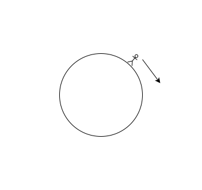

圆环问题的简单思考。

<!-- more -->

小人停留在橡皮环的某一点，橡皮环初始周长为 $100$ 米，然后小人在环上行走，速度为 $1\text{m/s}$。但橡皮环每 $1$ 秒后，又会瞬间均匀拉伸 $100$ 米，问小人能否回到起点？

分析：小人第 $1$ 秒走了 $1$ 米，橡皮环伸长后相当于走了全长的

$$
\frac{2}{200} = \frac{1}{100}
$$

同理，第二秒走了全长的

$$
\frac{1}{100} + \frac{1}{200}
$$

那么 $n$ 秒后走了全长的

$$
\begin{aligned}
    P_n &= \frac{1}{100} + \frac{1}{200} + \frac{1}{300} + ... + \frac{1}{100n} \\
    &= \frac{1}{100}\left(1 + \frac{1}{2} + \frac{1}{3} + \frac{1}{4} + ... + \frac{1}{n}\right) \\
    &= \frac{1}{100}\sum_{i=1}^{n}{\frac{1}{i}} \\
    &= \frac{1}{100}H_n
\end{aligned}
$$

这是一个调和级数，必然存在 $n$，使得 $P_n \geqslant 1$，显然可以回到起点。

数 $H_N$ 叫做调和数，其和叫做调和和。下面近似式中的误差趋向于 $\gamma \approx 0.57721566$，这个值被称为 **欧拉常数**。

$$
H_N = \sum_{i=1}^{N}{\frac{1}{i}} \approx \ln N
$$

$$
H_N = \sum_{i=1}^{N}{\frac{1}{i}} = \ln N + \gamma\ (n\rightarrow\infty)
$$
