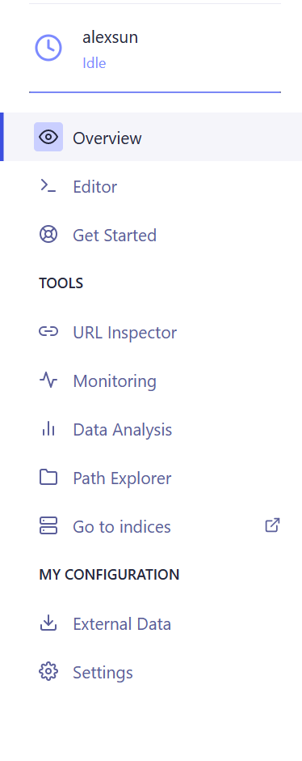
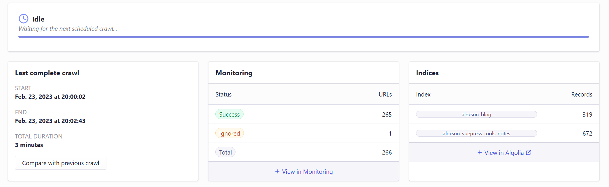
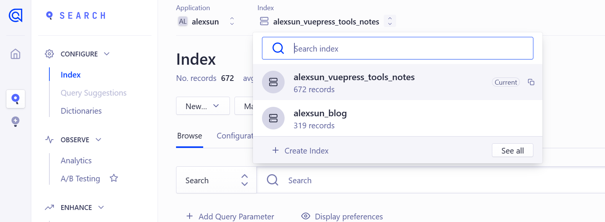

介绍如何使用 Algolia 来优化博客的搜索引擎。

<!-- more -->

## 1. 申请加入 DocSearch 项目

可以在 [加入 DocSearch](https://docsearch.algolia.com/apply/) 页面提交，DocSearch 团队会将 `apiKey` 和 `indexName` 发送到你的邮箱。

收到邮件后 [配置爬虫](https://crawler.algolia.com/admin)，选择你的应用，你将下面的配置界面。



在 Editor 可以编辑爬虫设置，我们主要用这个功能来自定义我们的爬虫设置。

我们主要设置 Actions。

::: tabs

@tab 默认主题

```js
{
  indexName: "你的 Index",
  pathsToMatch: ["https://<你的网站>/**"],
  recordExtractor: ({ helpers }) => {
    return helpers.docsearch({
      recordProps: {
        lvl0: {
          selectors: ".sidebar-heading.active",
          defaultValue: "Documentation",
        },
        lvl1: ".theme-default-content h1",
        lvl2: ".theme-default-content h2",
        lvl3: ".theme-default-content h3",
        lvl4: ".theme-default-content h4",
        lvl5: ".theme-default-content h5",
        lvl6: ".theme-default-content h6",
        content: ".theme-default-content p, .theme-default-content li",
      },
      indexHeadings: true,
    });
  },
},

```

@tab Hope 主题

```js
{
  indexName: "你的 Index",
  pathsToMatch: ["https://<你的网站>/**"],
  recordExtractor: ({ helpers }) => {
    return helpers.docsearch({
      recordProps: {
        lvl0: {
          selectors: ".sidebar-heading.active",
          defaultValue: "Documentation",
        },
        lvl1: ".theme-hope-content h1",
        lvl2: ".theme-hope-content h2",
        lvl3: ".theme-hope-content h3",
        lvl4: ".theme-hope-content h4",
        lvl5: ".theme-hope-content h5",
        lvl6: ".theme-hope-content h6",
        content: ".theme-hope-content p, .theme-hope-content li",
      },
      indexHeadings: true,
    });
  },
},
```

:::

其中 `pathsToMatch` 使用 [micromatch](https://github.com/micromatch/micromatch) 语法来匹配你的网站。

## 2. 安装到 VuePress 项目

```bash
pnpm add -D @algolia/client-search
pnpm add -D @vuepress/plugin-docsearch@next
```

如果你使用的是 VuePress 的默认主题，可参考 [官方文档](https://v2.vuepress.vuejs.org/zh/reference/plugin/docsearch.html) 来配置。

配置示例：

```js
export default {
  plugins: [
    docsearchPlugin({
      appId: 'DF0MW*******',
      apiKey: '******************',
      indexName: 'alexsun_blog',
      placeholder: '搜索文档',
      translations: {
        button: {
          buttonText: '搜索文档',
          buttonAriaLabel: '搜索文档',
        },
        modal: {
          searchBox: {
            resetButtonTitle: '清除查询条件',
            resetButtonAriaLabel: '清除查询条件',
            cancelButtonText: '取消',
            cancelButtonAriaLabel: '取消',
          },
          startScreen: {
            recentSearchesTitle: '搜索历史',
            noRecentSearchesText: '没有搜索历史',
            saveRecentSearchButtonTitle: '保存至搜索历史',
            removeRecentSearchButtonTitle: '从搜索历史中移除',
            favoriteSearchesTitle: '收藏',
            removeFavoriteSearchButtonTitle: '从收藏中移除',
          },
          errorScreen: {
            titleText: '无法获取结果',
            helpText: '你可能需要检查你的网络连接',
          },
          footer: {
            selectText: '选择',
            navigateText: '切换',
            closeText: '关闭',
            searchByText: '搜索提供者',
          },
          noResultsScreen: {
            noResultsText: '无法找到相关结果',
            suggestedQueryText: '你可以尝试查询',
            reportMissingResultsText: '你认为该查询应该有结果？',
            reportMissingResultsLinkText: '点击反馈',
          },
        }
      }
    })
  ]
}
```

## 3. 配置多个站点

如图，点击 **View in Algolia**，然后登录。



选择正确的应用，然后点击 **Search**，即可看到下图的内容，选择上方的 **Index**，然后创建新的 Index，请保持每个应用的前缀一致以方便区分。



然后在不同的 Action 中指定你创建的 Index 名称即可。
